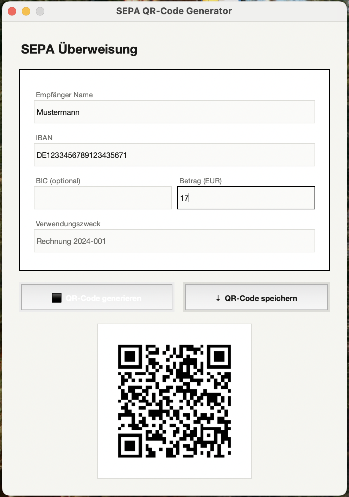

# Sepa-QR-Code-Generator

Ein schlankes Desktop-Tool zum Erstellen von SEPA-konformen QR-Codes für bargeldlose Überweisungen – basierend auf dem **EPC-Standard (GiroCode)**.

---

## Screenshot


```
┌─────────────────────────────────────────┐
│  SEPA Überweisung                        │
│ ┌─────────────────────────────────────┐ │
│ │ Empfänger Name                       │ │
│ │ [Max Mustermann                    ] │ │
│ │ IBAN                                 │ │
│ │ [DE89 3704 0044 0532 0130 00       ] │ │
│ │ BIC (optional)   │ Betrag (EUR)      │ │
│ │ [COBADEFFXXX   ] │ [49.99         ] │ │
│ │ Verwendungszweck                     │ │
│ │ [Rechnung 2024-001                 ] │ │
│ └─────────────────────────────────────┘ │
│  [■ QR-Code generieren] [↓ Speichern]   │
│ ┌─────────────────────────────────────┐ │
│ │         [QR-Code Vorschau]           │ │
│ └─────────────────────────────────────┘ │
└─────────────────────────────────────────┘
```

---

## Features

- **EPC/GiroCode-konform** – erzeugt QR-Codes nach dem europäischen Standard (BCD, Version 002, SCT), der von allen gängigen Banking-Apps gelesen wird
- **Live-Vorschau** – der generierte QR-Code wird direkt im Fenster angezeigt
- **Speichern als PNG** – nativer Datei-Dialog zum Speichern unter beliebigem Pfad
- **Eingabevalidierung** – Pflichtfelder und Betragsformat werden vor der Generierung geprüft
- **BIC optional** – seit SEPA-Migration nicht mehr zwingend erforderlich, kann aber angegeben werden
- **Platzhalter-UX** – Felder zeigen Beispielwerte als Orientierung

---

## Voraussetzungen

- Python 3.8 oder neuer
- Pakete:

```bash
pip install segno pillow
```

| Paket    | Zweck                              |
|----------|------------------------------------|
| `segno`  | QR-Code-Generierung (EPC-konform)  |
| `Pillow` | Bildverarbeitung für die Vorschau  |
| `tkinter`| GUI-Framework (in Python enthalten)|

---

## Installation & Start

```bash
# Repository klonen oder Datei herunterladen
git clone https://github.com/dein-name/sepa-qr-generator.git
cd sepa-qr-generator

# Abhängigkeiten installieren
pip install segno pillow

# Anwendung starten
python sepa_qr_gui.py
```

---

## Bedienung

1. **Empfänger Name** – vollständiger Name des Zahlungsempfängers (Pflicht)
2. **IBAN** – internationale Kontonummer, Leerzeichen werden automatisch entfernt (Pflicht)
3. **BIC** – Bank Identifier Code des Empfängers (optional)
4. **Betrag** – Überweisungsbetrag in Euro, Komma oder Punkt als Dezimaltrennzeichen (Pflicht)
5. **Verwendungszweck** – Freitext, max. 140 Zeichen (optional)
6. **„QR-Code generieren"** klicken → QR-Code erscheint in der Vorschau
7. **„QR-Code speichern"** klicken → Datei-Dialog öffnet sich, Standard-Dateiname: `ueberweisung.png`

---

## EPC-Payload-Format

Der erzeugte QR-Code enthält folgende Struktur (zeilenweise):

```
BCD          ← Service Tag
002          ← Version
1            ← Zeichensatz (UTF-8)
SCT          ← SEPA Credit Transfer
<BIC>        ← optional
<Name>       ← Empfänger
<IBAN>       ← ohne Leerzeichen
EUR<Betrag>  ← z. B. EUR49.99
             ← Zweckschlüssel (leer)
             ← Referenz (leer)
<Zweck>      ← Verwendungszweck
             ← Info (leer)
```

---

## Kompatibilität

Der erzeugte GiroCode wird von folgenden Apps unterstützt:

- Deutsche Bank, Sparkasse, Volksbank, ING, DKB, Comdirect (und weitere)
- Google Pay, Apple Pay (über jeweilige Banking-App)
- Alle Apps, die den EPC-QR-Standard implementieren

---

## Lizenz

MIT License – freie Verwendung, Weitergabe und Anpassung.
